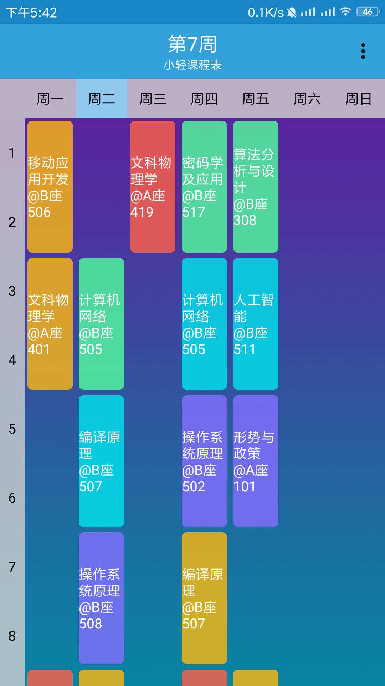

# LightTimetable
仿超级课程表/Android课程表/简洁

---
### 小轻课程表
* 简洁
* 支持Excel导入课程
* 支持教务系统导入（中南大学）
* 可设置背景和透明度

---
### 界面

---
### 注意事项
Excel导入（因为使用jxl包所以**只支持xls文件**） 
不支持冲突课程，如果冲突，会显示最后的课程 
**Excel格式示例**

 
<a href="https://raw.githubusercontent.com/Potato-DiGua/ClassTimetables/master/ReadmeResourse/Example.xls">下载示例Excel</a>
 
**单元格格式:**
第一行为课程名 
第二行为教师 
第三行为上课的周数（单周，双周，周用[]括起来,周数也可以用英文,隔开，中间没有空格） 
示例 **1-16[单周]** 或 **7,8[周]** 或**7,8,9,11-16[周]** 
第四行为上课地点 

同一单元格有两个课程空一行隔开 

**第一行必须为星期，第一列为节数，不能有多余的表头。** 
一天只支持12节课。 
**Excel算上表头只支持(列数x行数)8x7** 

---
##### 开发者的废话(可跳过)
因为超级课程表有很多多余的东西，而且想看课程表的话，打开速度很慢，不能秒开，所以就想模仿写一个精简版的，于是就有了本app

